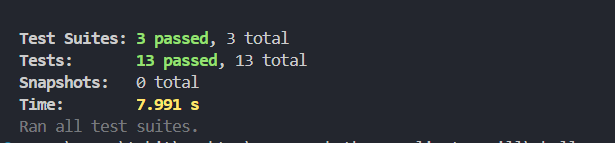

# Mofa's Kitchen Buddy - Recipe Management System

A comprehensive recipe management system that allows users to manage recipes, ingredients, and get AI-powered recipe recommendations based on available ingredients.

## Features

- Recipe management with text and image upload
- OCR-powered recipe extraction from images
- Ingredient inventory management
- AI-powered recipe recommendations using Groq
- Comprehensive test suite
- RESTful API endpoints

## Test Collection
You can test all the APIs using our Postman collection:
- [Postman Collection Link](https://xtradrill.postman.co/workspace/XtraDrill-Workspace~da8b9283-aafd-42c9-833a-3497697f2512/collection/32046757-04c35e70-76a7-4581-a3e7-4a2f33ec2d6e?action=share&creator=32046757)


## Prerequisites

- Node.js (v14 or higher)
- Tesseract OCR
- Groq API Key (for AI recommendations)

## Installation

1. Clone the repository
2. Install dependencies:
```bash
npm install
```

3. Install Tesseract OCR:
   - Download Tesseract installer from [GitHub](https://github.com/UB-Mannheim/tesseract/wiki)
   - Install to `C:\Program Files\Tesseract-OCR`
   - Add Tesseract to PATH:
     1. Open System Properties > Advanced > Environment Variables
     2. Under System Variables, find PATH
     3. Add `C:\Program Files\Tesseract-OCR`
     4. Restart your terminal

4. Set up environment variables:
Create a `.env` file in the `Chellenge 2 Folder` directory with:
```bash
PORT=3000
GROQ_API_KEY=your_api_key_here
```

5. Get Groq API Key:
   - Visit [Groq](https://groq.com/)
   - Sign up for an account
   - Generate an API key from your dashboard
   - Add the key to your `.env` file

6. Start the development server:
```bash
npm run dev
```

The server will start on `http://localhost:3000`

## API Documentation

### Recipes API

#### Get All Recipes
- **Route**: `/api/recipes`
- **Method**: GET
- **Sample Response**:
```json
{
  "recipes": [
    "Tomato Pasta\nIngredients:\n- Pasta\n- Tomatoes\n- Garlic\n\nInstructions:\n1. Boil pasta\n2. Make sauce\n3. Combine",
    "Chicken Curry\nIngredients:\n- Chicken\n- Spices\n\nInstructions:\n1. Cook chicken\n2. Add spices"
  ]
}
```

#### Add Recipe (Text)
- **Route**: `/api/recipes`
- **Method**: POST
- **Sample Payload**:
```json
{
  "recipe": "Tomato Pasta\nIngredients:\n- Pasta\n- Tomatoes\n- Garlic\n\nInstructions:\n1. Boil pasta\n2. Make sauce\n3. Combine"
}
```
- **Sample Response**:
```json
{
  "message": "Recipe added successfully"
}
```

#### Add Recipe (Image)
- **Route**: `/api/recipes/image`
- **Method**: POST
- **Content-Type**: multipart/form-data
- **Form Data**:
  - Key: recipe
  - Type: File
  - Value: [Image File]
- **Sample Response**:
```json
{
  "message": "Recipe extracted and added successfully",
  "extractedText": "Extracted recipe content from image..."
}
```

#### Search Recipes
- **Route**: `/api/recipes/search`
- **Method**: GET
- **Query Parameters**: query (string)
- **Sample Response**:
```json
{
  "recipes": [
    "Tomato Pasta\nIngredients:\n- Pasta\n- Tomatoes\n- Garlic\n\nInstructions:\n1. Boil pasta\n2. Make sauce\n3. Combine"
  ]
}
```

### Ingredients API

#### Get All Ingredients
- **Route**: `/api/ingredients`
- **Method**: GET
- **Sample Response**:
```json
[
  {
    "id": "1",
    "name": "tomato",
    "quantity": 5,
    "unit": "pieces",
    "createdAt": "2024-12-21T15:30:00.000Z",
    "updatedAt": "2024-12-21T15:30:00.000Z"
  }
]
```

#### Add Ingredient
- **Route**: `/api/ingredients`
- **Method**: POST
- **Sample Payload**:
```json
{
  "name": "tomato",
  "quantity": 5,
  "unit": "pieces"
}
```
- **Sample Response**:
```json
{
  "message": "Ingredient added successfully",
  "ingredient": {
    "id": "1",
    "name": "tomato",
    "quantity": 5,
    "unit": "pieces",
    "createdAt": "2024-12-21T15:30:00.000Z",
    "updatedAt": "2024-12-21T15:30:00.000Z"
  }
}
```

#### Update Ingredient
- **Route**: `/api/ingredients/:id`
- **Method**: PUT
- **Sample Payload**:
```json
{
  "quantity": 3
}
```
- **Sample Response**:
```json
{
  "message": "Ingredient updated successfully"
}
```

#### Delete Ingredient
- **Route**: `/api/ingredients/:id`
- **Method**: DELETE
- **Sample Response**:
```json
{
  "message": "Ingredient deleted successfully"
}
```

### Chatbot API

#### Get Recipe Recommendation
- **Route**: `/api/chatbot/recommend`
- **Method**: POST
- **Sample Payload**:
```json
{
  "preference": "I want something with tomatoes"
}
```
- **Sample Response**:
```json
{
  "recommendation": "Based on your ingredients, I recommend making a fresh tomato pasta. You have all the necessary ingredients: tomatoes, pasta, and garlic..."
}
```

## Testing

The project includes a comprehensive test suite covering all major functionalities:

```bash
npm test
```


Test coverage includes:
- Recipe management (text & image)
- Ingredient operations
- Chatbot recommendations
- Error handling
- Input validation

## Postman Collection

Test the API endpoints using our Postman collection:
[XtraDrill Workspace - Mofa's Kitchen Buddy](https://xtradrill.postman.co/workspace/XtraDrill-Workspace~da8b9283-aafd-42c9-833a-3497697f2512/request/32046757-efd22680-97cf-4928-9538-eea79f882f6f?action=share&creator=32046757)

## Common Issues & Solutions

### Tesseract Not Found
If you get "Tesseract not found" error:
1. Verify Tesseract is installed in `C:\Program Files\Tesseract-OCR`
2. Check PATH includes Tesseract directory
3. Restart your terminal/IDE
4. Test with: `tesseract --version`

### Image Upload Issues
- Ensure uploads directory exists
- Check file permissions
- Supported formats: JPG, PNG, TIFF
- Maximum file size: 5MB

## Architecture

The system follows a modular architecture:
- `routes/` - API endpoints
- `services/` - Business logic
- `__tests__/` - Test suite
- `data/` - Data storage
- `uploads/` - Temporary image storage

## License

MIT License - See LICENSE file for details